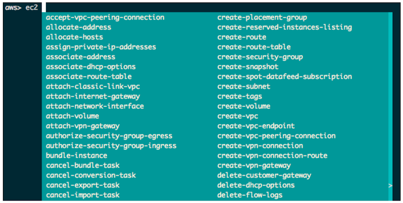
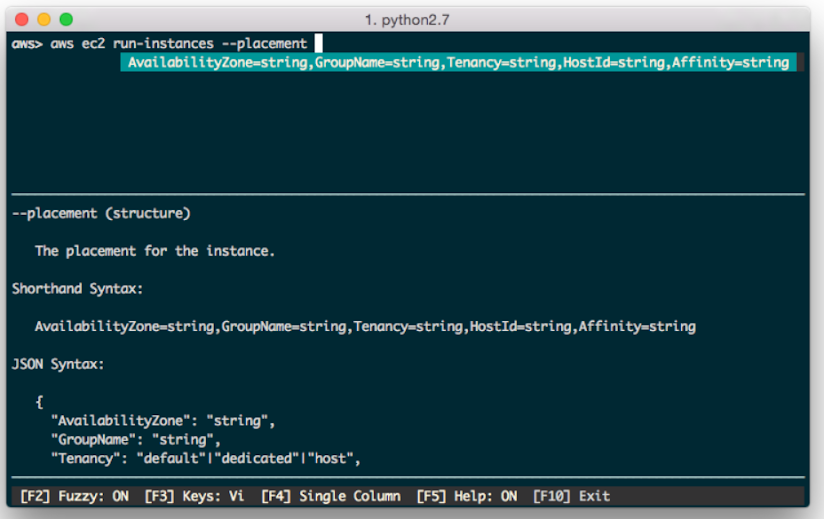
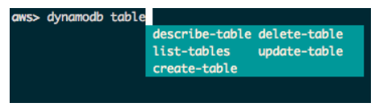
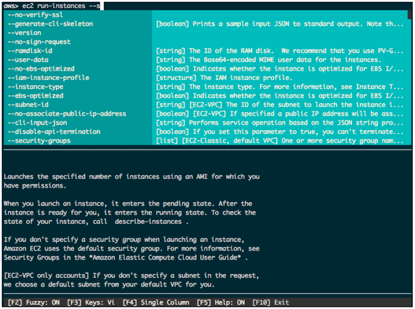
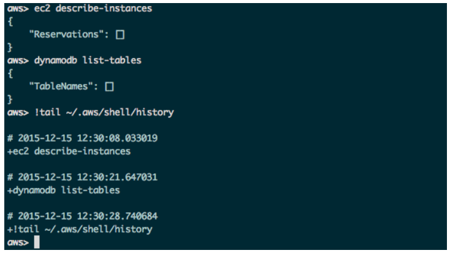
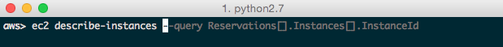

# aws-shell

Dear aws-shell, 

How do I love thee? Let me count the ways.

## 1) You complete me  

Auto Completion of Commands and Options




## 2) You know what I'm about to say before I say it  

Shorthand Auto Completion



## 3) You make me all warm and fuzzy  

Fuzzy Search



## 4)  When we first met, I knew I could read you like a book  

Inline Documentation



## 5) You're a good listener and remember what I say without having to repeat myself

Command History



## 6) You're always thinking ahead

Fish-Style Auto Suggestion. Use the right arrow key to complete a suggestion.



## 7)  I can go on and on...
  
      [foo](https://github.com/awslabs/aws-shell)
<hr>

# I'm digging this! How do I get started?

<pre>
$ virtualenv aws-shell
$ source aws-shell/bin/activate
$ cd aws-shell
$ pip install aws-shell
$ aws-shell
</pre>

## Usage

From the aws> prompt, start typing your AWS CLI command ** without ** the "aws" that typically precedes the command.

=== Example 1: The Basics ===

Instead of "aws ec2 describe-instances", simply type 

```
"ec2 describe-instances"
```

=== Example 2: Auto completion ===

From the aws> prompt type,
```
ec2 termi<tab key> <space> --inst<tab key> <space>  
```

If typed correctly, the above will produce the artifact "aws ec2 terminate-instances --instance-ids" followed by a complete list of running ec2 instances that you can perform auto-completion against. 

Every time you hit the tab key, aws-shell will auto-complete what it knows about.  If you've typed a command previously, the text will be displayed and grayed out and you can hit the right arrow key to use the auto-suggestion. The tab and right arrow keys can be real time savers if you find yourself doing a lot of experimentation with the benefit of eliminating typos! 
     
## Disclaimer
I've noticed the ssh terminal becoming unresponsive when the aws-shell is left open too long using Putty in Windows 10 with an ssh connection going over VPN.  Your mileage and chances of encountering this may vary (or not even be an issue based on your OS, personal settings, and connection type).  But in the event you do encounter the terminal becoming unresponsive after some time, you should be able to reconnect to your instance using a new ssh connection. 

To exit the shell,  use **Ctrl-D**. 
Type "**deactivate**" to exit the virtual environment.

You can use the traditional AWS-CLI commands again from this point on if you're not impressed or find little value with aws-shell's enhancements. I didn't say it would solve world hunger. :)
